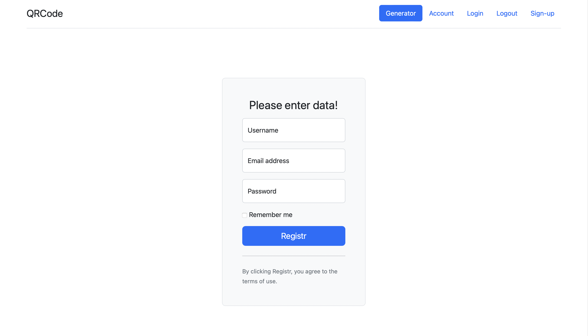
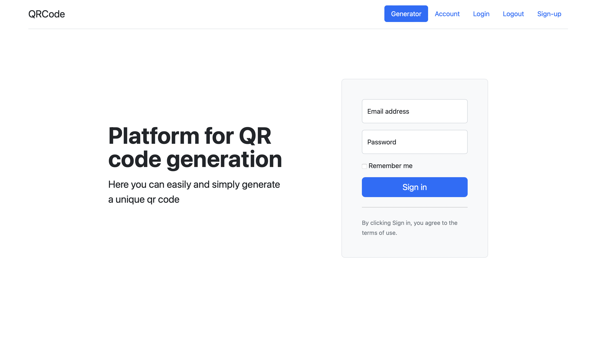
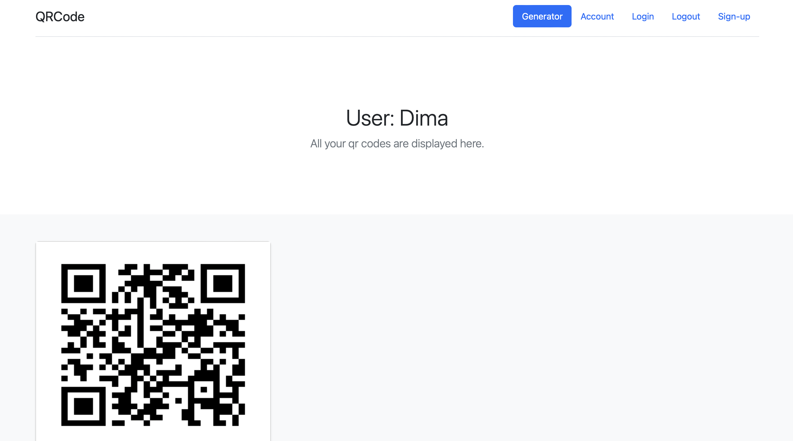
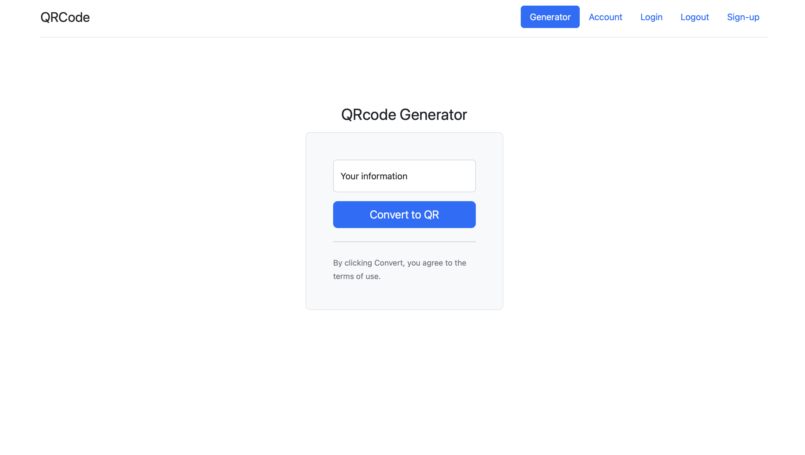

# QR Generator

This project is a web application developed using the Python language and the Flask framework. The goal of the project is to provide a user-friendly interface for generating qr codes by the user

## **Application Description:**

### The application allows the user to:

1. User registration on the site 
2. User authorization and session exit 
3. Generation of qr codes 
4. Viewing generated codes in the user's personal account

### Additional functions:

1. Encodes qr code data to save it to the database 
2. Decodes qr code data to render it on the page 
3. Checks the user's mail in the database 
4. Checks the user's mail in the database with the entered password on the site

## **Architecture:**

The application consists of the following components:

- Web Server: Used by Flask to serve HTTP requests and return responses.
- Database: We use SQLite to store user data and qr code data
- Models: These are Python classes that define the structure of data in a database and define how that data can be stored, retrieved, and modified.
- There is a user model, that includes: nickname, mail, password, link with qr codes in the code table, which belong to the user
- There is a qr code model that includes: encrypted code data and owner user id
- Templates: These are HTML files that define the look and feel of web pages.
- Controllers: These are Flask functions that process HTTP requests using models and templates and return responses to the web server.

- When the user sends an HTTP request to the web server, the controller receives the request and uses the models to get or save the qr code to the SQLite database

## **How to launch:**

1. Clone this repository on your computer:

```
git clone https://github.com/chumachenkoo/Generator_QR.git
```

2. Install Docker and Docker Compose on your machine.

```
Docker documentation: https://docs.docker.com/get-docker/
Docker Compose documentation: https://docs.docker.com/compose/install/
```

3. Launch the Docker daemon on your machine:
    
4. Build and start the application using Docker Compose:

```
docker-compose up --build
```


The application should now be available at **[http://localhost:5050/](http://localhost:5050/)**.

## **How to use the application:**

### Registration:

1. Click on the Sign-up button 
2. Filling in the data 
3. Click the Registry button 
4. We are redirected to the main page, the authorization page



### Authorization:

1. Entering data into fields 
2. Press the Sign in button 
3. We are redirected to the Account page



### View codes:

- The Account page displays previously generated codes



### Creation of qr code:

1. Click on the Generator button 
2. Enter data in the field 
3. Click on Convert to QR button 
4. We will be redirected to the Account page, where you will see your qr code



### Exit session:

- Click on the Logout button 
- We will be redirected to the main page
